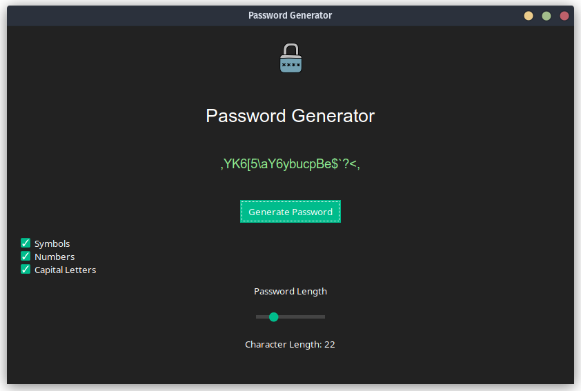

# Password Generator 🛡️

A simple and robust password generator with a user-friendly GUI. Generate passwords tailored to your needs with options for symbols, numbers, and capital letters.



## Features 🌟

- **User-friendly Interface:** Easily specify your password requirements using a clean GUI.
- **Customization:** Choose from symbols, numbers, and capital letters to include in your password.
- **Instant Copy:** Copy generated passwords to your clipboard with a single click.
- **Visual Feedback:** Get visual confirmation when your password is copied.

## Installation 🔧

1. Clone the repository and navigate to the project directory:
   ```bash
   git clone https://github.com/YOUR_USERNAME/Password-Generator.git && cd Password-Generator
   ```
2. Run the program:
  ```bash
   Python gui.py
  ```
## Dependencies 📦

- `tkinter`
- `ttkbootstrap`

## Contributing 🤝

Pull requests are welcome. For major changes, please open an issue first to discuss what you would like to change.

## License 📄

This project is licensed under the MIT License - see the [LICENSE.md](LICENSE.md) file for details.

